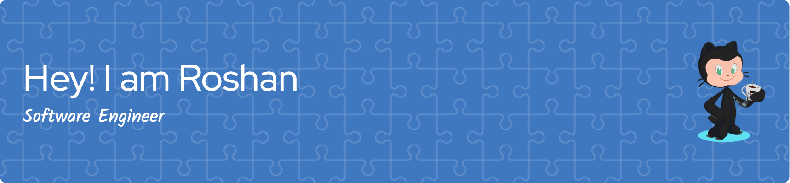

**I write clean code**

- 🔭 I’m currently working on something cool
- 🌱 I’m currently learning  **$\textcolor{brown}{Rust}$** 
- 👯 I’m looking to collaborate on anything cool
- 💬 Ask me about anything related to **$\textcolor{brown}{Javascript, Typescript, Java, Springboot, Data Structures, Machine Learning}$**
- 📫 How to reach me : [LinkedIn](https://www.linkedin.com/in/roshngupta)
- ⚡ Fun fact : I like Stock trading

<!-- Comment Example -->

 
  <table>
    <tr>
      <td></td>
      <td></td>
    </tr>
  </table>
 

<!--  -->

